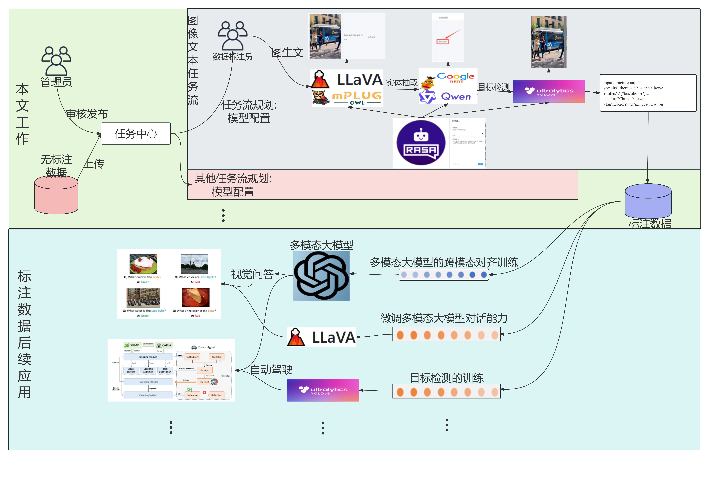

## Introduction

This project was my undergraduate capstone design, which was also awarded as an Excellent Graduation Project in Beijing. It was completed under the guidance of Dr.Zhang Qing from North China University of Technology.

## Abstract

随着大数据技术的迅猛发展，人工智能特别是深度学习领域取得了显著进展，多模态数据标注的重要性日益凸显，但当前多模态数据标注平台存在费时费力、标注质量难以保证、依赖大量人工干预、处理复杂数据时准确性和灵活性不足的缺点，且前后端集成不完善，用户体验差。为解决该问题，本设计旨在构建一个基于SpringBoot和Vue的多模态数据标注平台，通过结合前端Vue框架和后端SpringBoot框架，提供用户友好的界面和高效的后台服务，提升图像和文本数据的标注效率。平台引入Agent思想，实现了可配置的子模态任务分解、模态间任务关联的人机协作式流水线，并通过Rasa对话系统实现人机协同标注，利用自然语言处理技术提供智能问答与交互，进一步提升标注效率和准确性。平台支持多用户协作及数据安全管理，为大规模多模态数据的高效标注提供有力工具。

With the rapid development of big data technology, AI and deep learning have made significant progress, highlighting the importance of multimodal data annotation. However, current multimodal data annotation platforms are time-consuming, labor-intensive, and often lack reliability, accuracy, and flexibility. They also suffer from poor front-end and back-end integration, resulting in a subpar user experience. To address these issues, this design aims to build a multimodal data annotation platform based on SpringBoot and Vue, offering a user-friendly interface and efficient backend service to enhance the annotation of image and text data. By integrating the agent concept and the Rasa dialogue system, the platform enables configurable task decomposition and human-machine collaborative annotation through natural language processing, improving efficiency and accuracy. It supports multi-user collaboration and data security management, providing a powerful tool for large-scale multimodal data annotation.

## Related Work

本研究构建的多模态数据标注平台采用前后端分离架构，基于SpringBoot和Vue.js，通过RESTful API实现高效数据传输。系统后端使用SpringMVC和SpringBoot框架，前端采用Vue.js，数据存储使用MySQL。关键技术包括YOLOv8用于目标检测，mPLUG和LLaVA用于图像与文本的跨模态转换，Rasa用于高级对话系统，Qwen和BERT用于实体抽取。这些技术共同提升了系统的数据处理准确性和效率，实现了高效、智能的数据标注与管理。

The multi-modal data annotation platform constructed in this research adopts a front-end and back-end separation architecture, based on SpringBoot and Vue.js, with RESTful APIs enabling efficient data transmission. The system's back end utilizes the SpringMVC and SpringBoot frameworks, while the front end employs Vue.js. MySQL is used for data storage. Key technologies include YOLOv8 for object detection, mPLUG and LLaVA for cross-modal conversion between images and text, Rasa for advanced dialogue systems, and Qwen and BERT for entity extraction. These technologies collectively enhance the accuracy and efficiency of data processing, achieving efficient and intelligent data annotation and management.

## System Design Diagram

  

